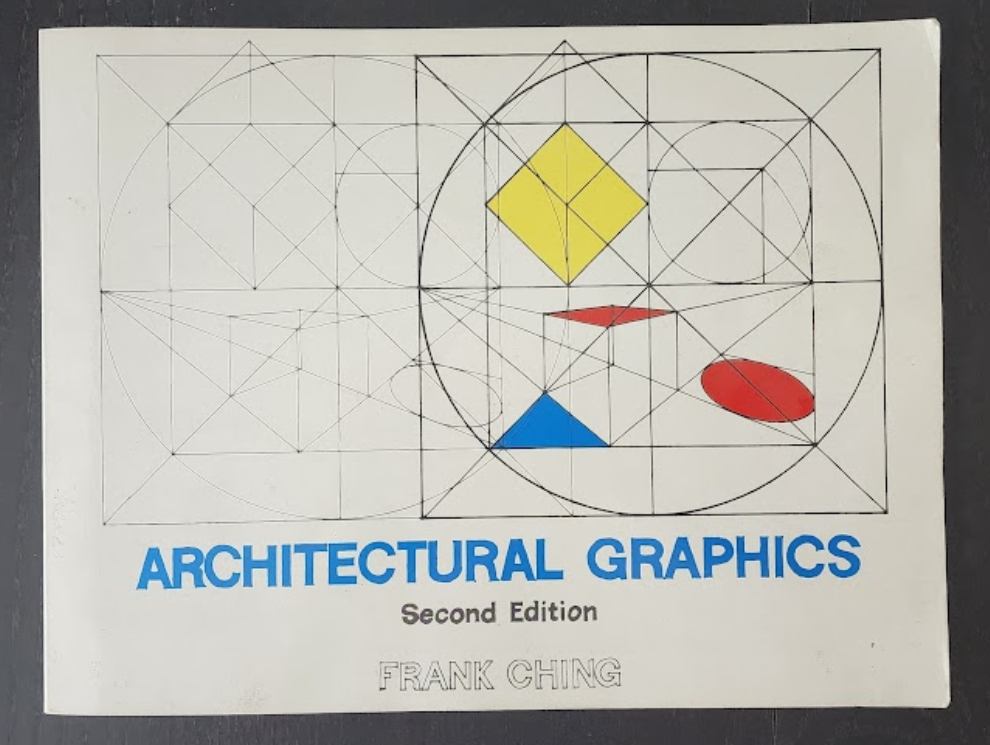
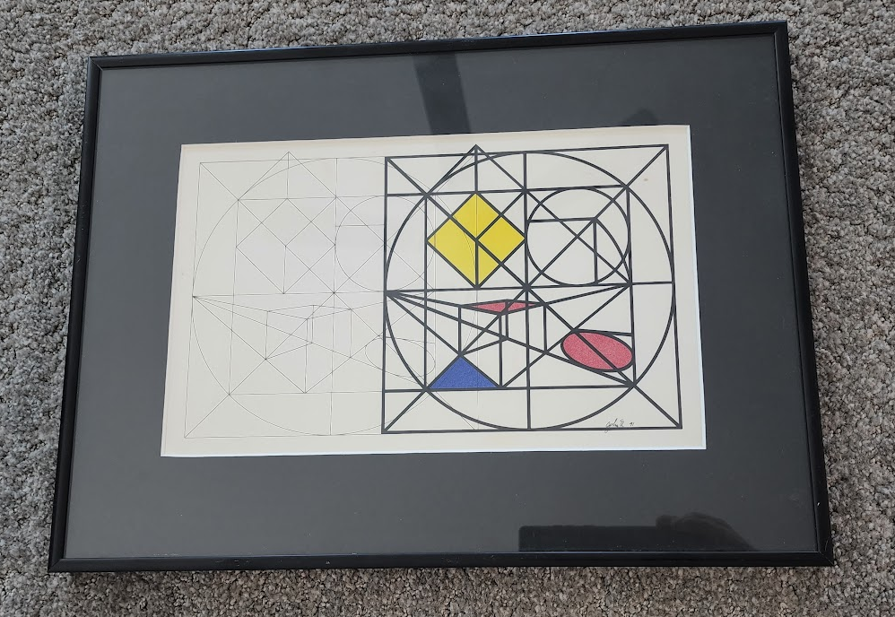
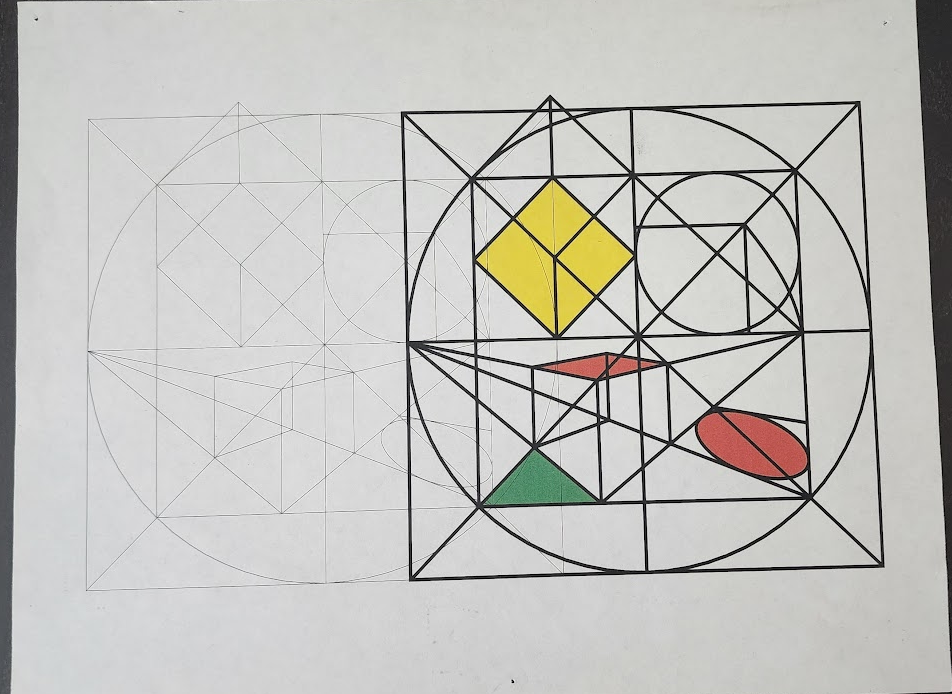

# The_Drawing
There's a geometrical drawing on the cover of "Architectural Graphics", 2nd ed, 1985, by Frank Ching.   This is 'C' code to reproduce the figure by generating HPGL2.  HPGL2 is the graphics language understand by old LaserJets, like the LaserJet 4.

HPGL2 was also in high-end inkjets produced by HP in Rancho Bernardo in the mid 90's.   Almost all the remaining output I have is from those machines.

---

Here is the cover from Architectural Graphics, 1985

---

I drew the figure by hand using pen and Ink in 1991.  I had some crude drafting tools to work with.

---

In 1993 I joined Hewlett Packard "San Diego Printer" division in Rancho Bernardo, CA.
My 1st job of substance was to port the HPGL macro package from the LaserJet code-base
to the SPR code-base.   SPR had high-end Ink-Jet printers at the time, code compatible
with LaserJets (pretty much).

I needed HPGL source material to use for testing of the macros, which were really just page overlays.

I had the brilliant idea of turning "That Drawing" into an HPGL2 program.

And so I did that.  Here is the result, printed out on a Goldrush, circa 1995.

